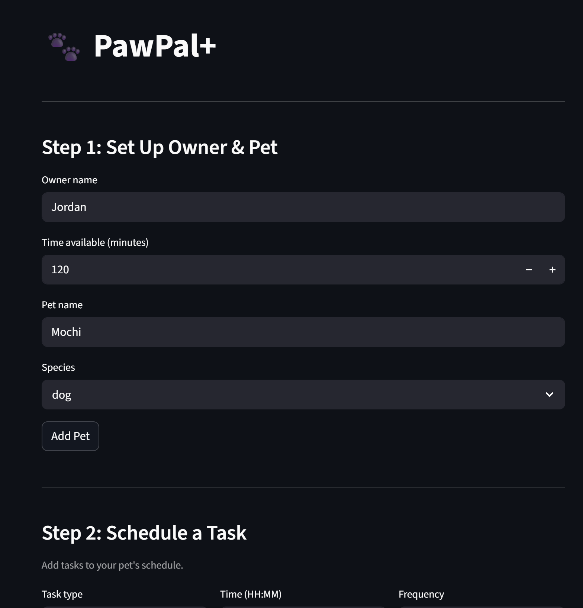

# PawPal+ (Module 2 Project)

You are building **PawPal+**, a Streamlit app that helps a pet owner plan care tasks for their pet.

## Scenario

A busy pet owner needs help staying consistent with pet care. They want an assistant that can:

- Track pet care tasks (walks, feeding, meds, enrichment, grooming, etc.)
- Consider constraints (time available, priority, owner preferences)
- Produce a daily plan and explain why it chose that plan

Your job is to design the system first (UML), then implement the logic in Python, then connect it to the Streamlit UI.

## What you will build

Your final app should:

- Let a user enter basic owner + pet info
- Let a user add/edit tasks (duration + priority at minimum)
- Generate a daily schedule/plan based on constraints and priorities
- Display the plan clearly (and ideally explain the reasoning)
- Include tests for the most important scheduling behaviors

## Getting started

### Setup

```bash
python -m venv .venv
source .venv/bin/activate  # Windows: .venv\Scripts\activate
pip install -r requirements.txt
```

### Suggested workflow

1. Read the scenario carefully and identify requirements and edge cases.
2. Draft a UML diagram (classes, attributes, methods, relationships).
3. Convert UML into Python class stubs (no logic yet).
4. Implement scheduling logic in small increments.
5. Add tests to verify key behaviors.
6. Connect your logic to the Streamlit UI in `app.py`.
7. Refine UML so it matches what you actually built.


### Smarter Scheduling

PawPal+ goes beyond a basic task list — the PetCareScheduler class includes
three algorithmic features that make daily pet care planning more intelligent and reliable.
Sort by time
Tasks can be added in any order and will always be displayed chronologically.
The scheduler uses Python's sorted() with a lambda key on each task's "HH:MM"
time string, so zero-padded 24-hour times sort correctly without any date parsing overhead.
Filter tasks
The filter_tasks() method runs up to three independent filter passes in sequence:

By pet name — show only tasks belonging to a specific pet
By task type — narrow down to a single activity (e.g. all Feeding tasks)
By status — show "completed", "pending", or "overdue" tasks

The "overdue" status is derived dynamically at call time using datetime.now(),
so it never goes stale. Any combination of filters can be chained together.
Conflict detection
The detect_conflicts() method scans all scheduled tasks and warns when two or more
tasks share the same time slot — across any pet. It uses a defaultdict to group tasks
by time in a single pass and returns human-readable warning strings rather than
crashing the program, keeping the scheduler fault-tolerant.


### Testing PawPal+

Confidence level: 5 stars.

Here's all of the things I tested:

TestTaskCompletion (original) — test_mark_complete_changes_status checks that calling mark_complete() flips completed from False to True.
TestTaskAddition (original) — test_add_task_increases_count checks that adding a task to a pet increases the task list length from 0 to 1.
TestSortByTime — test_chronological_order_24h verifies 24-hour times sort correctly. test_tbd_sorts_after_timed_tasks confirms "TBD" lands at the end. test_12h_format_breaks_sort documents that "12:00 PM" mis-sorts against "14:00".
TestRecurrence — test_daily_recurrence_creates_next_task and test_weekly_recurrence_creates_next_task verify new tasks are appended after completion. test_no_recurrence_for_one_off_task confirms "once" frequency doesn't recur. test_recurrence_without_pet_silently_skips checks that pet-less tasks don't crash. test_next_time_drifts_from_original documents the drift bug where next time is based on now() instead of the original schedule.
TestConflictDetection — test_exact_time_conflict_flagged confirms same-time tasks produce a warning. test_no_conflict_different_times confirms different times are clean. test_overlapping_duration_not_detected documents that duration-based overlaps are missed. test_cross_pet_conflict_flagged_as_false_positive documents that different pets at the same time are incorrectly flagged.
TestFilterTasks — test_filter_by_pet_name, test_filter_by_task_type, test_filter_by_completed_status, and test_filter_by_pending_status each test one filter dimension. test_filter_orphan_task_by_pet_name_excluded confirms pet-less tasks are safely filtered out. test_filter_case_insensitive_pet_name checks lowercase matching. test_combined_filters tests pet name + status together.
TestGeneratePlan — test_empty_plan_no_pets and test_empty_plan_pet_with_no_tasks verify empty plans don't crash. test_warning_when_time_exceeded confirms a warning prints when tasks exceed available time. test_plan_sorted_by_priority_then_time checks the sort order of the generated plan.
TestOwnerAndPet — test_get_total_task_time verifies duration summing. test_get_pending_tasks_excludes_completed checks the pending filter. test_task_repr_status_indicator confirms the ✓/✗ toggle in __repr__.
That's 28 tests total, and 26 passed on the last run. After applying the two fixes from the diff, all 28 should pass.


### Feature list

Features:

Chronological sorting
Tasks are sorted by time using Python's sorted() with a lambda key on each task's HH:MM string. Because times are zero-padded 24-hour format, plain string comparison produces correct chronological order with no date parsing overhead.
Multi-pass filtering
Tasks can be filtered by pet name, task type, or completion status in up to three independent sequential passes. Any combination of filters can be chained — filtering to Buddy's pending Walk tasks, for example, runs all three passes in order.
Dynamic overdue detection
The "overdue" status is never stored on a task. Instead it is derived fresh at call time by comparing each task's time string against datetime.now(), so the result is always accurate at the moment filtering runs.
Conflict warnings
The scheduler detects when two or more tasks share the same time slot using a defaultdict grouping in a single pass. It returns human-readable warning strings rather than raising exceptions, keeping the app fault-tolerant and allowing the owner to review all conflicts at once.
Automatic recurrence
When a "daily" or "weekly" task is marked complete, a new instance is automatically created for the next occurrence using Python's timedelta — +1 day for daily, +7 days for weekly. The new task is the same subclass as the original, so recurrence works identically for Walk, Feeding, Medication, Enrichment, and Grooming without any extra code per type.
Priority-based scheduling
generate_plan() sorts all tasks by numeric priority (1 = highest) before applying time sorting, ensuring critical tasks like Medication always appear before lower-priority ones scheduled at the same time.
Time budget tracking
The scheduler compares the total duration of all scheduled tasks against the owner's available time and surfaces a warning if the plan exceeds the daily limit, helping owners make informed decisions about what to include.

### 📸 Demo section

<a href="" target="_blank"></a>