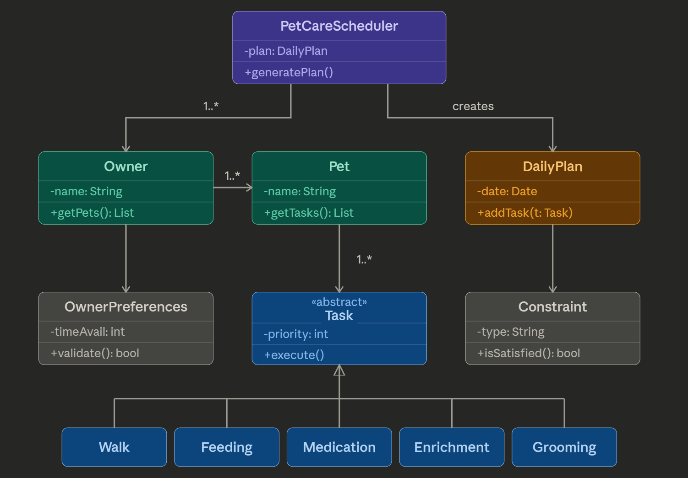

# PawPal+ Project Reflection

## 1. System Design

**a. Initial design**

- Briefly describe your initial UML design.
- What classes did you include, and what responsibilities did you assign to each? 
PetCareScheduler — the top-level orchestrator that generates the daily plan
Owner — represents a pet owner with their list of pets
Pet — a pet that has one or more care tasks associated with it
OwnerPreferences — stores the owner's constraints like time availability and priorities
DailyPlan — the output of the scheduler; the structured plan for the day
Task — an abstract base class for all care activities
Constraint — a rule or condition the scheduler must satisfy when building the plan
Walk — concrete task subtype
Feeding — concrete task subtype
Medication — concrete task subtype
Enrichment — concrete task subtype
Grooming — concrete task subtype

**b. Design changes**

- Did your design change during implementation?
yes
- If yes, describe at least one change and why you made it.
    def is_satisfied(self, task: Task, plan: DailyPlan) -> bool:  # add params

        self.duration = duration  # minutes needed
        self.pet = pet            # back-reference to owning Pet

---

## 2. Scheduling Logic and Tradeoffs

**a. Constraints and priorities**

- What constraints does your scheduler consider (for example: time, priority, preferences)?Time availability
Time of day 
Frequency 
Conflict
- How did you decide which constraints mattered most?
Time availability — the Owner has a time_available (in minutes) and generate_plan() warns if the total task duration exceeds it. This prevents over-scheduling the owner's day.
Priority — every Task has a numeric priority (1 = highest). Tasks are sorted by priority first, so critical tasks like Medication always appear before lower-priority ones like Grooming.
Time of day — sort_by_time() arranges tasks chronologically so the plan reflects a realistic daily order (07:00 before 18:00).
Frequency — tasks are tagged as "daily" or "weekly", which controls whether a new instance is auto-created after completion.
Conflict — detect_conflicts() checks if two tasks overlap at the same time slot.

**b. Tradeoffs**

- Describe one tradeoff your scheduler makes.

The scheduler sorts by priority first, then time — meaning a high-priority task at 19:00 will appear before a low-priority task at 07:00 in the plan ordering, even though it happens later in the day.

- Why is that tradeoff reasonable for this scenario?

This tradeoff is reasonable here because pet care often has medically critical tasks (like medication) that must not be skipped regardless of when they occur. Prioritizing urgency over strict chronological order ensures the owner sees the most important tasks at the top of the plan. A real-world improvement would be to balance both — for example, only reordering by priority when two tasks are close in time.

---

## 3. AI Collaboration

**a. How you used AI**

- How did you use AI tools during this project (for example: design brainstorming, debugging, refactoring)?
- What kinds of prompts or questions were most helpful?

**b. Judgment and verification**

- Describe one moment where you did not accept an AI suggestion as-is.
- How did you evaluate or verify what the AI suggested?

---

## 4. Testing and Verification

**a. What you tested**

- What behaviors did you test?
- Why were these tests important?

**b. Confidence**

- How confident are you that your scheduler works correctly?
- What edge cases would you test next if you had more time?

---

## 5. Reflection

**a. What went well**

- What part of this project are you most satisfied with?

**b. What you would improve**

- If you had another iteration, what would you improve or redesign?

**c. Key takeaway**

- What is one important thing you learned about designing systems or working with AI on this project?
