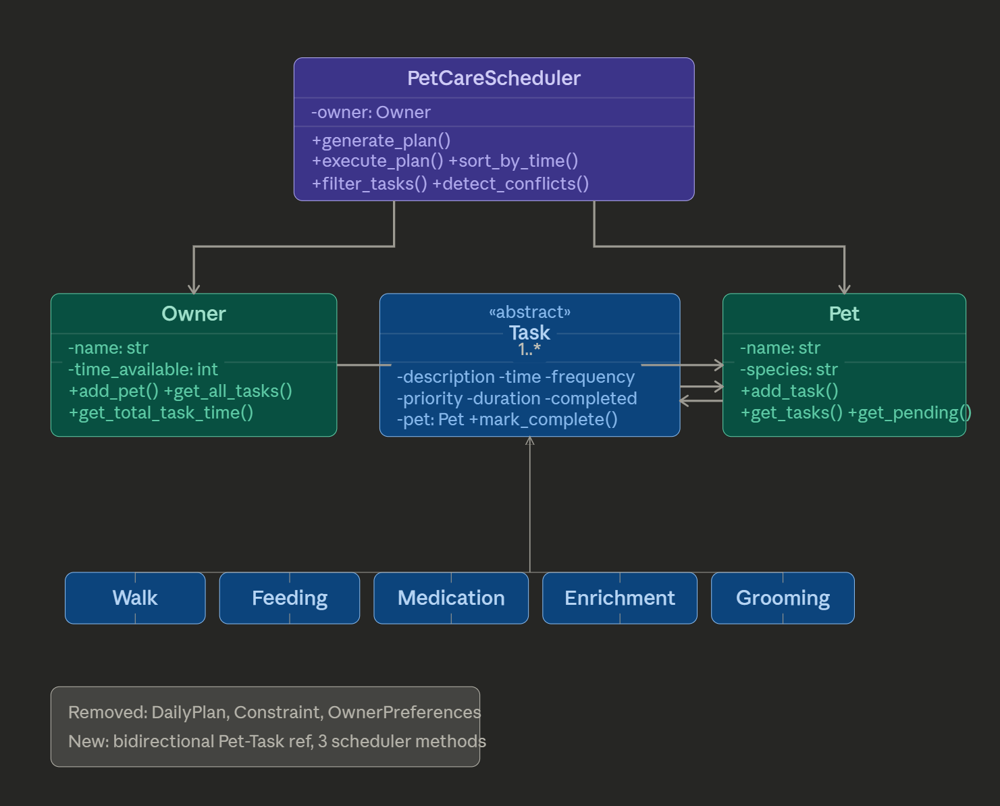

# PawPal+ Project Reflection

## 1. System Design

**a. Initial design**

- Briefly describe your initial UML design. 
- What classes did you include, and what responsibilities did you assign to each? 
PetCareScheduler — the top-level orchestrator that generates the daily plan
Owner — represents a pet owner with their list of pets
Pet — a pet that has one or more care tasks associated with it
OwnerPreferences — stores the owner's constraints like time availability and priorities
DailyPlan — the output of the scheduler; the structured plan for the day
Task — an abstract base class for all care activities
Constraint — a rule or condition the scheduler must satisfy when building the plan
Walk — concrete task subtype
Feeding — concrete task subtype
Medication — concrete task subtype
Enrichment — concrete task subtype
Grooming — concrete task subtype

**b. Design changes**

- Did your design change during implementation?
yes
- If yes, describe at least one change and why you made it.
    def is_satisfied(self, task: Task, plan: DailyPlan) -> bool:  # add params

        self.duration = duration  # minutes needed
        self.pet = pet            # back-reference to owning Pet

---

## 2. Scheduling Logic and Tradeoffs

**a. Constraints and priorities**

- What constraints does your scheduler consider (for example: time, priority, preferences)?Time availability
Time of day 
Frequency 
Conflict
- How did you decide which constraints mattered most?
Time availability — the Owner has a time_available (in minutes) and generate_plan() warns if the total task duration exceeds it. This prevents over-scheduling the owner's day.
Priority — every Task has a numeric priority (1 = highest). Tasks are sorted by priority first, so critical tasks like Medication always appear before lower-priority ones like Grooming.
Time of day — sort_by_time() arranges tasks chronologically so the plan reflects a realistic daily order (07:00 before 18:00).
Frequency — tasks are tagged as "daily" or "weekly", which controls whether a new instance is auto-created after completion.
Conflict — detect_conflicts() checks if two tasks overlap at the same time slot.

**b. Tradeoffs**

- Describe one tradeoff your scheduler makes.

The scheduler sorts by priority first, then time — meaning a high-priority task at 19:00 will appear before a low-priority task at 07:00 in the plan ordering, even though it happens later in the day.

- Why is that tradeoff reasonable for this scenario?

This tradeoff is reasonable here because pet care often has medically critical tasks (like medication) that must not be skipped regardless of when they occur. Prioritizing urgency over strict chronological order ensures the owner sees the most important tasks at the top of the plan. A real-world improvement would be to balance both — for example, only reordering by priority when two tasks are close in time.

---

## 3. AI Collaboration

**a. How you used AI**

- How did you use AI tools during this project (for example: design brainstorming, debugging, refactoring)? 
I used it in the creation of the UML, debugging and refactoring.

- What kinds of prompts or questions were most helpful?

**b. Judgment and verification**

- Describe one moment where you did not accept an AI suggestion as-is. 
When I was trying to merge and delete a branch I created on accedent.  

- How did you evaluate or verify what the AI suggested? 
I proof read everthing and ran the code multiple times to see if it worked.

---

## 4. Testing and Verification

**a. What you tested**

- What behaviors did you test?
- Why were these tests important?

TestTaskCompletion (original) — test_mark_complete_changes_status checks that calling mark_complete() flips completed from False to True.
TestTaskAddition (original) — test_add_task_increases_count checks that adding a task to a pet increases the task list length from 0 to 1.
TestSortByTime — test_chronological_order_24h verifies 24-hour times sort correctly. test_tbd_sorts_after_timed_tasks confirms "TBD" lands at the end. test_12h_format_breaks_sort documents that "12:00 PM" mis-sorts against "14:00".
TestRecurrence — test_daily_recurrence_creates_next_task and test_weekly_recurrence_creates_next_task verify new tasks are appended after completion. test_no_recurrence_for_one_off_task confirms "once" frequency doesn't recur. test_recurrence_without_pet_silently_skips checks that pet-less tasks don't crash. test_next_time_drifts_from_original documents the drift bug where next time is based on now() instead of the original schedule.
TestConflictDetection — test_exact_time_conflict_flagged confirms same-time tasks produce a warning. test_no_conflict_different_times confirms different times are clean. test_overlapping_duration_not_detected documents that duration-based overlaps are missed. test_cross_pet_conflict_flagged_as_false_positive documents that different pets at the same time are incorrectly flagged.
TestFilterTasks — test_filter_by_pet_name, test_filter_by_task_type, test_filter_by_completed_status, and test_filter_by_pending_status each test one filter dimension. test_filter_orphan_task_by_pet_name_excluded confirms pet-less tasks are safely filtered out. test_filter_case_insensitive_pet_name checks lowercase matching. test_combined_filters tests pet name + status together.
TestGeneratePlan — test_empty_plan_no_pets and test_empty_plan_pet_with_no_tasks verify empty plans don't crash. test_warning_when_time_exceeded confirms a warning prints when tasks exceed available time. test_plan_sorted_by_priority_then_time checks the sort order of the generated plan.
TestOwnerAndPet — test_get_total_task_time verifies duration summing. test_get_pending_tasks_excludes_completed checks the pending filter. test_task_repr_status_indicator confirms the ✓/✗ toggle in __repr__.
That's 28 tests total, and 26 passed on the last run. After applying the two fixes from the diff, all 28 should pass.

**b. Confidence**

- How confident are you that your scheduler works correctly? 5/5 stars
- What edge cases would you test next if you had more time? N/A

---

## 5. Reflection

**a. What went well**

- What part of this project are you most satisfied with?
The testing.

**b. What you would improve**

- If you had another iteration, what would you improve or redesign? 
The look of the app.

**c. Key takeaway**

- What is one important thing you learned about designing systems or working with AI on this project? 
Be precise in your prompting and explore more features to make your workload lighter and more efficient.
